# Terraform AWS Infrastructure

## 概要

このプロジェクトは、AWSクラウド上にマルチAZ構成の高可用性インフラストラクチャをTerraformで構築します。

## アーキテクチャ構成

```mermaid
graph TB
    %% VPCコンテナ
    subgraph VPC["🌐 VPC (10.0.0.0/16)"]
        %% Internet Gateway
        IGW["🌍 Internet Gateway"]
        
        %% AZ-1a (青色系)
        subgraph AZ1["🏢 Availability Zone: ap-northeast-1a"]
            %% パブリックサブネット1
            subgraph PubSub1["🌐 Public Subnet (10.0.1.0/24)"]
                EIP1["📍 Elastic IP"]
                NAT1["🚪 NAT Gateway"]
                EC2Pub1["💻 EC2 (Public)"]
            end
            
            %% プライベートサブネット1
            subgraph PrivSub1["🔒 Private Subnet (10.0.11.0/24)"]
                EC2Priv1["💻 EC2 (Private)"]
            end
            
            %% ルートテーブル1
            PubRT1["📋 Public Route Table"]
            PrivRT1["📋 Private Route Table"]
        end
        
        %% AZ-1c (緑色系)
        subgraph AZ2["🏢 Availability Zone: ap-northeast-1c"]
            %% パブリックサブネット2
            subgraph PubSub2["🌐 Public Subnet (10.0.2.0/24)"]
                EIP2["📍 Elastic IP"]
                NAT2["🚪 NAT Gateway"]
                EC2Pub2["💻 EC2 (Public)"]
            end
            
            %% プライベートサブネット2
            subgraph PrivSub2["🔒 Private Subnet (10.0.12.0/24)"]
                EC2Priv2["💻 EC2 (Private)"]
            end
            
            %% ルートテーブル2
            PubRT2["📋 Public Route Table"]
            PrivRT2["📋 Private Route Table"]
        end
        
        %% セキュリティグループ
        SG["🛡️ Security Group (SSH)"]
        
        %% デフォルトルートテーブル
        DefaultRT["📋 Default Route Table"]
    end
    
    %% 外部インターネット
    Internet["🌍 Internet"]
    
    %% 接続関係
    Internet --> IGW
    IGW --> PubSub1
    IGW --> PubSub2
    
    %% NAT Gateway接続
    EIP1 --> NAT1
    EIP2 --> NAT2
    
    %% ルーティング
    PubRT1 --> IGW
    PubRT2 --> IGW
    PrivRT1 --> NAT1
    PrivRT2 --> NAT2
    
    %% サブネット関連付け
    PubSub1 -.-> DefaultRT
    PubSub2 -.-> DefaultRT
    PrivSub1 -.-> PrivRT1
    PrivSub2 -.-> PrivRT2
    
    %% セキュリティグループ適用
    SG -.-> EC2Pub1
    SG -.-> EC2Pub2
    SG -.-> EC2Priv1
    SG -.-> EC2Priv2
    
    %% スタイリング
    classDef az1 fill:#e1f5fe,stroke:#01579b,stroke-width:2px
    classDef az2 fill:#e8f5e8,stroke:#1b5e20,stroke-width:2px
    classDef public fill:#fff3e0,stroke:#e65100,stroke-width:2px
    classDef private fill:#fce4ec,stroke:#880e4f,stroke-width:2px
    classDef gateway fill:#f3e5f5,stroke:#4a148c,stroke-width:2px
    classDef rt fill:#fff8e1,stroke:#f57f17,stroke-width:2px
    
    class AZ1 az1
    class AZ2 az2
    class PubSub1,PubSub2,EC2Pub1,EC2Pub2 public
    class PrivSub1,PrivSub2,EC2Priv1,EC2Priv2 private
    class IGW,NAT1,NAT2 gateway
    class PubRT1,PubRT2,PrivRT1,PrivRT2,DefaultRT rt
```



## 構成要素

### ネットワーク層
- **VPC**: 10.0.0.0/16 - メインの仮想プライベートクラウド
- **Internet Gateway**: インターネット接続用ゲートウェイ
- **Application Load Balancer**: HTTPS/HTTP負荷分散（SSL終端対応）
- **パブリックサブネット**: 
  - ap-northeast-1a: 10.0.1.0/24
  - ap-northeast-1c: 10.0.2.0/24
- **プライベートサブネット**:
  - ap-northeast-1a: 10.0.11.0/24
  - ap-northeast-1c: 10.0.12.0/24

### 高可用性・冗長化
- **マルチAZ構成**: 2つのアベイラビリティゾーンを使用
- **NAT Gateway**: 各AZに1つずつ配置（計2個）
- **Elastic IP**: 各NAT Gatewayに1つずつ（計2個）
- **RDS Multi-AZ**: データベースの高可用性構成

### コンピュートリソース
- **EC2インスタンス**: パブリックサブネットに配置（計2個）
  - Application Load Balancerのターゲットとして登録
  - Auto Scalingグループでの管理対応

### データベース層
- **RDS MySQL 8.0**: Multi-AZ構成で高可用性
- **暗号化**: 保存時暗号化対応
- **自動バックアップ**: 7日間の保持期間
- **DB サブネットグループ**: プライベートサブネットでの分離配置

### セキュリティ
- **SSL/TLS証明書**: AWS Certificate Manager (ACM) で管理
- **HTTPS強制**: HTTP→HTTPSリダイレクト設定
- **セキュリティグループ**: EC2、ALB、RDS用の適切なアクセス制御
- **データベースセキュリティ**: アプリケーション層からのみアクセス可能
- **ルートテーブル**: 適切なトラフィック制御
  - パブリック: Internet Gateway経由
  - プライベート: NAT Gateway経由

## ファイル構成

```
terraform_study/
├── versions.tf              # Terraformバージョン制約
├── providers.tf             # AWSプロバイダー設定
├── variables.tf             # 変数定義（データベース変数含む）
├── terraform.tfvars         # 変数値（環境固有、DB認証情報含む）
├── network.tf              # ネットワーク、ALB、SSL リスナー
├── security.tf             # セキュリティグループ（EC2、ALB、RDS、ASG）
├── compute.tf              # EC2インスタンス
├── database.tf             # RDS MySQL（Multi-AZ、暗号化）
├── ssl.tf                  # ACM SSL証明書と検証
├── storage.tf              # S3バケット
├── data.tf                 # データソース
├── outputs.tf              # 出力値（RDS エンドポイント、SSL ARN含む）
└── main.tf                 # メインファイル（空）
```

## 使用方法

### 1. 初期化
```bash
terraform init
```

### 2. 実行計画の確認
```bash
terraform plan
```

### 3. 構文チェック
```bash
terraform validate
```

### 4. インフラ構築（AWS認証情報が必要）
```bash
terraform apply
```

### 5. リソース削除
```bash
terraform destroy
```

## 変数設定

主要な設定値は `terraform.tfvars` で管理：

- `region`: AWSリージョン（デフォルト: ap-northeast-1）
- `environment`: 環境名（デフォルト: dev）
- `vpc_cidr_block`: VPC CIDRブロック
- `availability_zones`: 使用するAZ
- `public_subnet_cidrs`: パブリックサブネットCIDR
- `private_subnet_cidrs`: プライベートサブネットCIDR
- `bucket_name`: S3バケット名（グローバルユニーク）
- `db_name`: データベース名
- `db_username`: データベースユーザー名
- `db_password`: データベースパスワード（機密情報）
- `db_instance_class`: RDSインスタンスタイプ
- `db_storage_size`: 初期ストレージサイズ
- `db_storage_max_size`: 最大ストレージサイズ（自動スケーリング）

## 出力値

- VPC ID
- サブネット ID（パブリック・プライベート）
- EC2インスタンス ID と パブリックIP
- S3バケット情報（名前、ARN、ドメイン名）
- AWSアカウント ID
- RDSデータベース情報（エンドポイント、ポート、インスタンスID）
- DBサブネットグループ名
- SSL証明書情報（ARN、ドメイン名）
- HTTPSリスナーARN

## 特徴

### 🏗️ エンタープライズレベルのアーキテクチャ
- 高可用性（Multi-AZ）
- セキュリティ重視（プライベートサブネット）
- スケーラブル設計

### 📦 モジュラー設計
- 機能別ファイル分割
- 再利用可能な構成
- 保守性の高いコード

### 🔒 セキュリティベストプラクティス
- プライベートサブネットでアプリケーション・データベース保護
- セキュリティグループによるアクセス制御（EC2、ALB、RDS）
- NAT Gateway経由の安全な外部通信
- SSL/TLS証明書による暗号化通信
- データベース暗号化（保存時・転送時）
- HTTP→HTTPS強制リダイレクト

## 学習ポイント

このプロジェクトで学習できる内容：

1. **Terraformの基本概念**
   - Resource、Data Source、Variable、Output
   - count による複数リソース作成
   - 依存関係管理

2. **AWSネットワーキング**
   - VPC設計とサブネット分割
   - ルーティングとゲートウェイ
   - マルチAZ構成
   - Application Load Balancerの構成

3. **データベース設計**
   - RDS Multi-AZ構成
   - データベース暗号化
   - サブネットグループとセキュリティ

4. **セキュリティ実装**
   - SSL/TLS証明書管理（ACM）
   - セキュリティグループ設計
   - 暗号化とアクセス制御

5. **インフラストラクチャ設計**
   - 高可用性アーキテクチャ
   - セキュリティ考慮事項
   - 運用性とスケーラビリティ

## 今後の拡張予定

- ✅ Application Load Balancer (ALB) - 実装済み
- Auto Scaling Group - 計画中
- ✅ RDS Database (Multi-AZ) - 実装済み
- CloudWatch監視・ログ収集
- ✅ SSL/TLS証明書管理 - 実装済み
- WAF (Web Application Firewall)
- CloudFront CDN
- ElastiCache (Redis)
- Lambda関数
- CI/CD パイプライン
